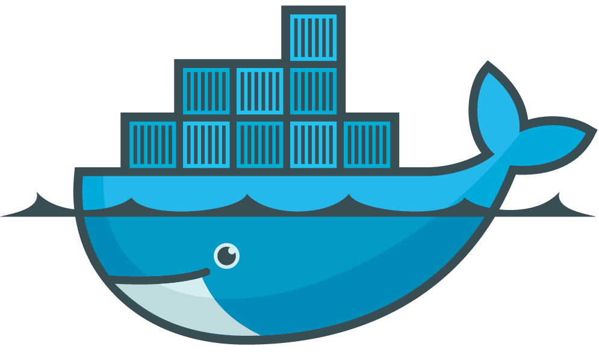
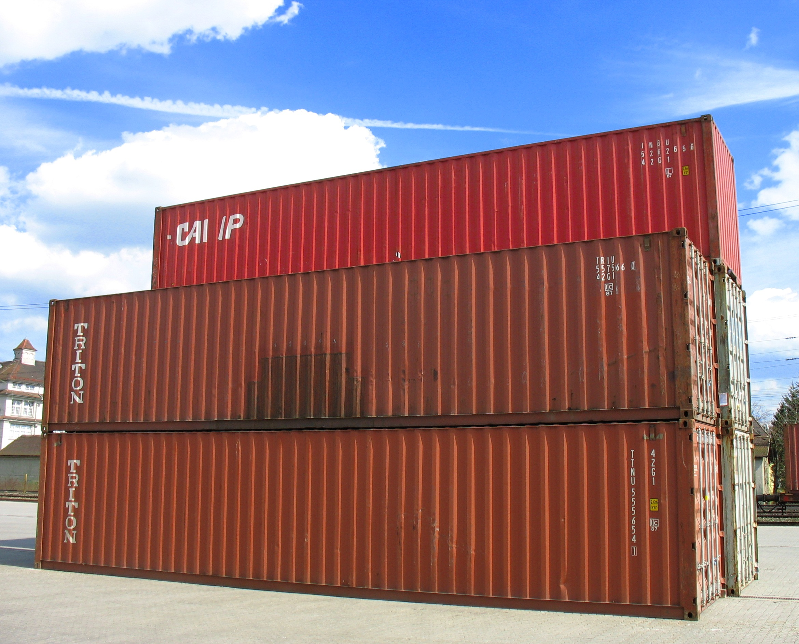
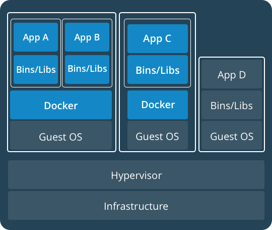
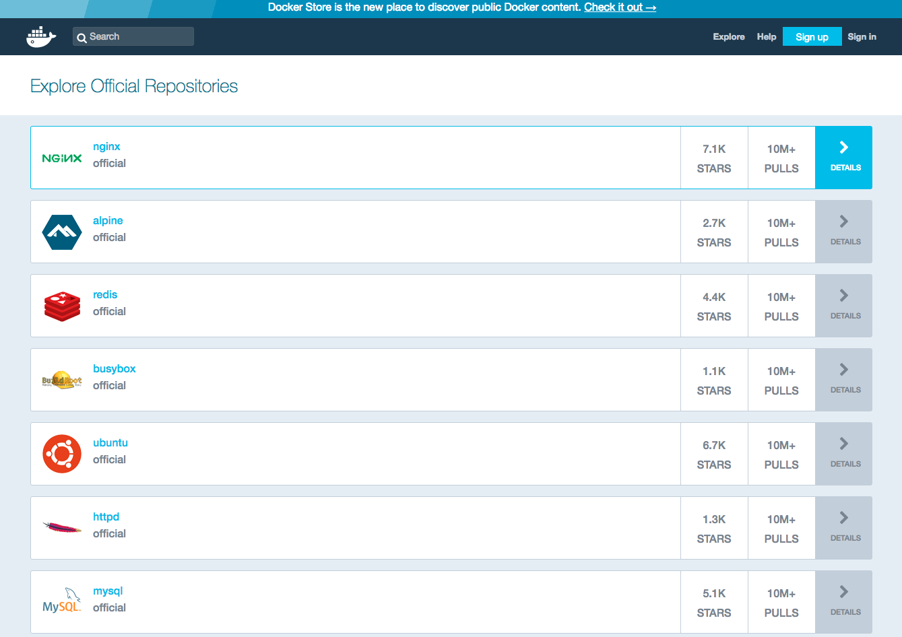
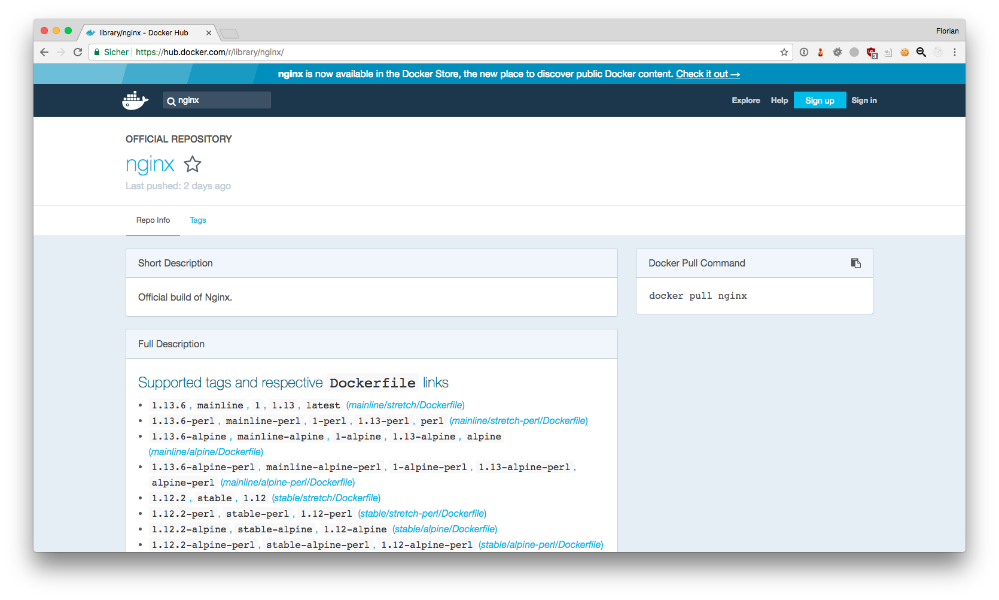
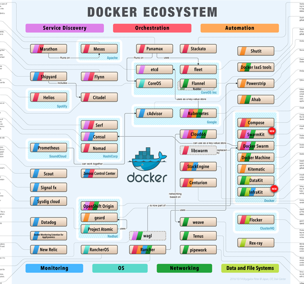

# Docker in der Praxis



----

## Über mich

<div style="position: absolute;width:50%;left:0%;text-align:left" >
    <strong>Florian Pfitzer</strong><br />
    <span style="font-size: 0.4em;display:block;">florian.pfitzer@to.com</span><br />
    <ul style="font-size: 0.5em;margin-top: -1em">
        <li>Thinking Objects GmbH</li>
        <li>Pentester</li>
        <li>20% Software Entwicklung</li>
        <li>Student an der HFT bis 2014</li>
    </ul>
</div>
<div style="position: absolute;width:50%;left:50%">
    
</div>

----

## Was sind Container?



Note: 
* Behälter die einfach zu transportieren sind.
* Eine VM für eine Anwendung mit allen Abhängigkeiten und Konfigurationsdateien.
* Genau definiertes und wiederverwendbarse Format.

----

## Container-Technologien

* Kernel-Patches
    * Linux-VServer
    * OpenVZ
* Linux-Kernel (Kernel Namespaces)
    * LXC/LXD
    * Docker
    * rkt

Note:
* Patches doof, weil man immer für jede neue Kernelversion den Patch braucht  (z.B. OpenVZ ist noch bei Linux Kernel 2.6). 

----

<div style="position: absolute;width:50%;left:0%" >
    <h2>VM</h2>
    
</div>
<div style="position: absolute;width:50%;left:50%" class="fragment">
    <h2>Container</h2>
    
</div>

Note:
* Vorteile:
    * Leichtgewichtiger
    * Viele bestehende Images
    * Mehr Container pro Host
    * Abhängigkeiten mit verschiedenen Versionen kein Problem mehr
    * OS unabhängig
* Nachteile
    * Weniger isolation

----



Note:
* Keine entweder oder Frage. Meistens einfach beides

----

## Warum brauch ich Container?

<div style="position: relative;width:300px;height: 400px;margin:0 auto">
    
    
</div>

Note:
* Überall die gleiche Umgebung.
* Ich kann nicht vergessen eine Abhänigkeit zu installieren, die zufälligerweise auf der Entwicklungs VM war.


---

## Was wir mit Docker machen

* auralis Mandatenfähigkeit
    * Monolotith -> "Miroservice" Architektur
* auralis Entwicklungsumgebung


---


###  Was macht Docker besonders?


----

## Images




----

<asciinema-player src="ascii/docker_pull.json" preload="true" speed="2"></asciinema-player>

----

<asciinema-player src="ascii/docker_run.json" preload="true" speed="2"></asciinema-player>


----


----

### Tags



Note:
* Es gibt für die meisten Images mehrere Tags
* Wenn nix angegegeben nimmt er latest

----

<asciinema-player src="ascii/docker_pull_tag.json" preload="true" speed="2"></asciinema-player>

----

## Eigene Images

```
FROM debian:stretch

RUN apt-get update && apt-get install -y nginx

EXPOSE 80

CMD ["nginx", "-g", "daemon off;"]
```

----

<asciinema-player src="ascii/docker_build.json" preload="true" speed="1" idle-time-limit="0.1"></asciinema-player>

----

<asciinema-player src="ascii/docker_build_run.json" preload="true" speed="1" idle-time-limit="0.1"></asciinema-player>

Note:
* Build once. Run anywhere

----

<asciinema-player src="ascii/docker_build_run2.json" preload="true" speed="1" idle-time-limit="0.1"></asciinema-player>

----

## Ökosystem

----



Note:
* Tools für Monitoring
* Tools für Container Verwaltung über mehrere Hosts (Orchestration)
* Tools für Netzwerk (Verschiedene Netzwerke über mehrere Hosts)
* Betriebssysteme nur für Container
* Dateiesysteme für Container über mehrere Hosts hinweg


----

## Docker-Compose

* Abhänigkeiten zwischen Containern
* Container gemeinsam starten und stoppen

----

```yaml
version: '3'

services:
   db:
     image: mysql:5.7
     volumes:
       - db_data:/var/lib/mysql
     restart: always
     environment:
       MYSQL_ROOT_PASSWORD: geheim
       MYSQL_DATABASE: wordpress
       MYSQL_USER: wordpress
       MYSQL_PASSWORD: wordpress

   wordpress:
     depends_on:
       - db
     image: wordpress:latest
     ports:
       - "8000:80"
     restart: always
     environment:
       WORDPRESS_DB_HOST: db:3306
       WORDPRESS_DB_USER: wordpress
       WORDPRESS_DB_PASSWORD: wordpress
volumes:
    db_data:
```

----


<asciinema-player src="ascii/docker_compose.json" preload="true" speed="4" idle-time-limit="0.1"></asciinema-player>

----


---

## Best Practices

----

### Dockerfiles

* Benutzen!
* Kein `:latest` benutzen
* `RUN` kombinieren
* Minimale Base-Images

Note:
* Wiederholbare Builds (Das Dockerfile ergibt immer das gleiche Image)
* RUN: Weniger Layer (kleinere Images)
* Kleinere Container wenn möglich

----

### Updates

* Kein `apt-get upgrade`!
* Container wegwerfen und neu bauen


----

### Volumes

* Daten vom Host in den Container bringen
* Für persitente Daten nutzen!

Note:
* Alles was nicht in Volumes ist geht verloren, wenn der Container gelöscht wird!

----

<asciinema-player src="ascii/docker_volume.json" preload="true" speed="1" idle-time-limit="0.1"></asciinema-player>

----

### Automatisieren!

* Builds automatisieren
* Deploy automatisieren

Note:
* Auch wenns nur ein Cronjob ist oder ein Makefile
* Es macht den Umgang mit Containern einfacher


----

### Ausprobieren!

[www.docker.com/get-docker](https://www.docker.com/get-docker)


